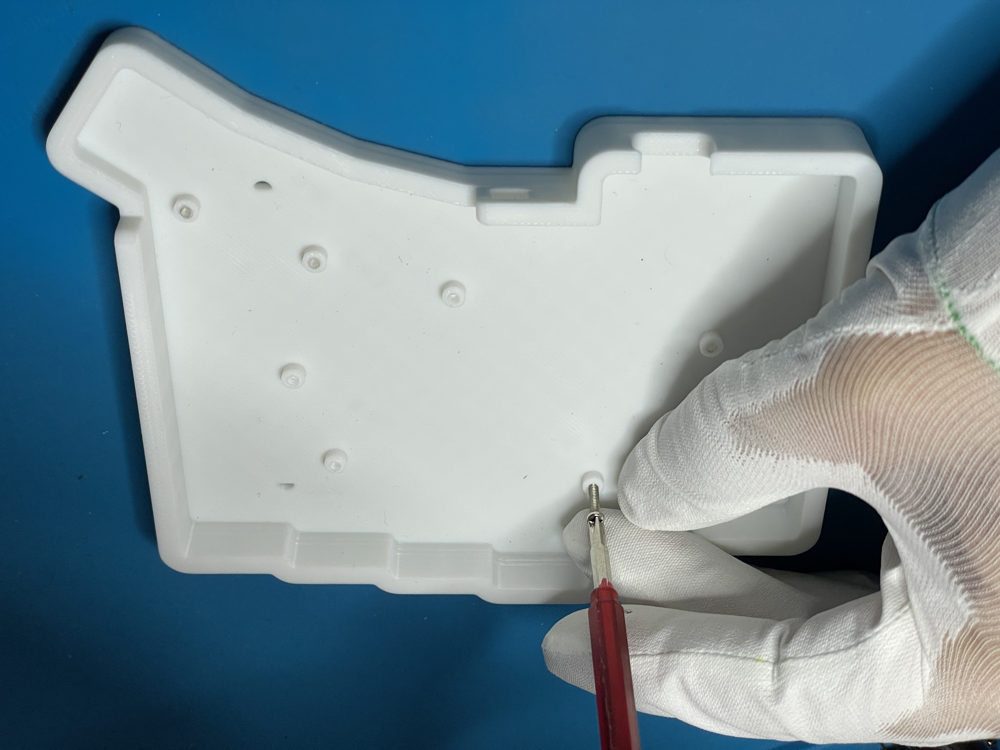
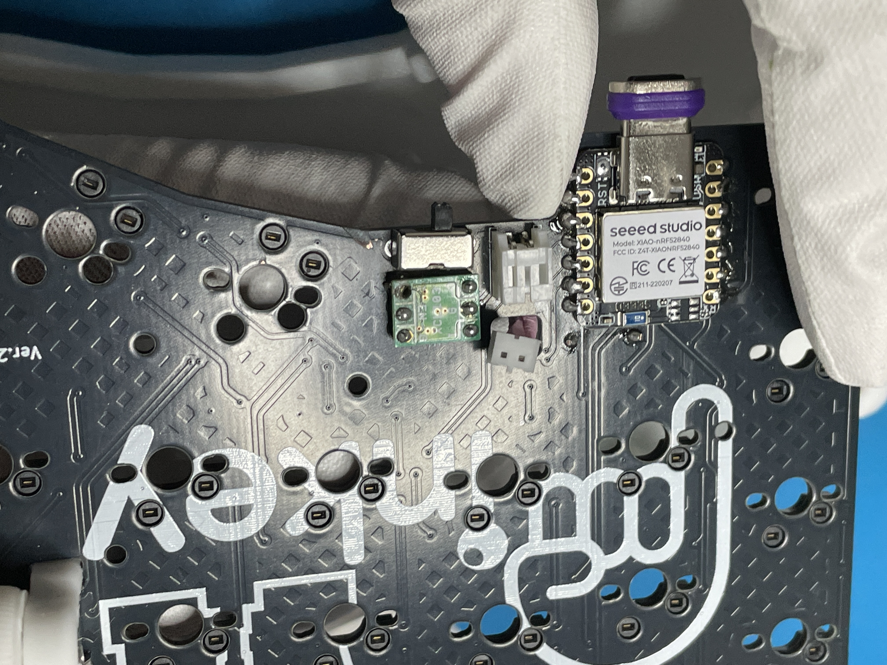
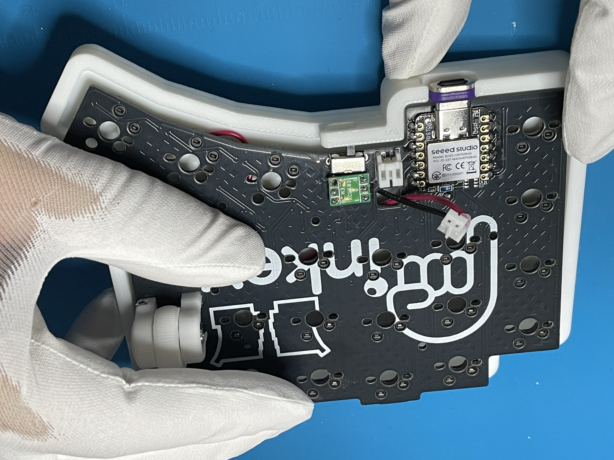
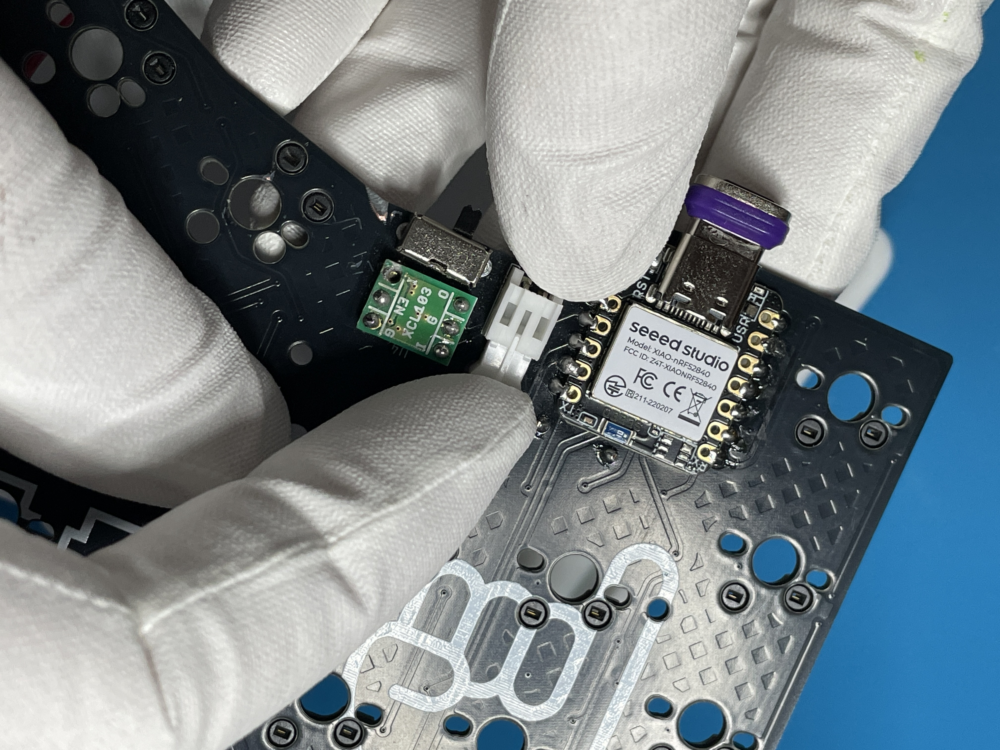
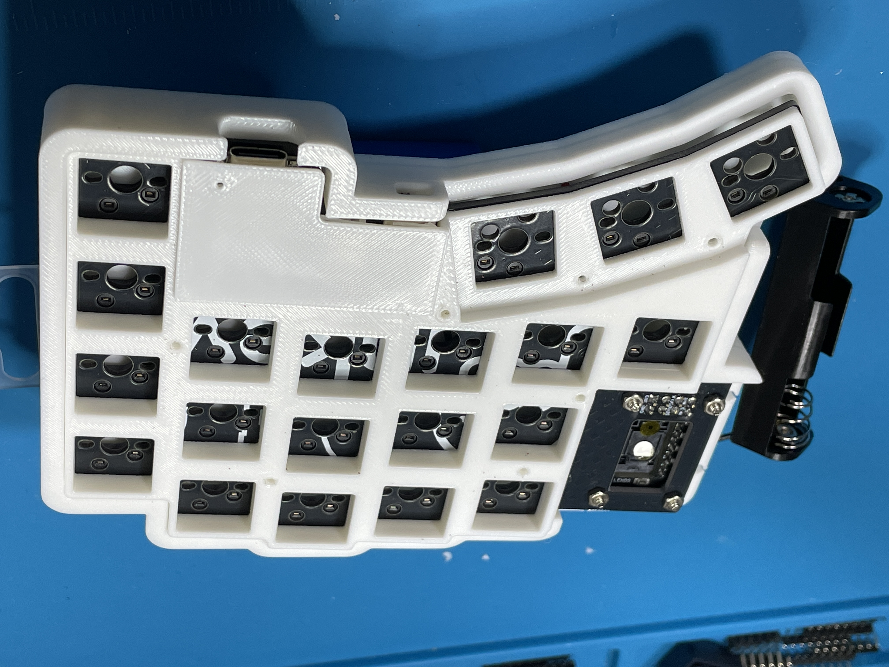
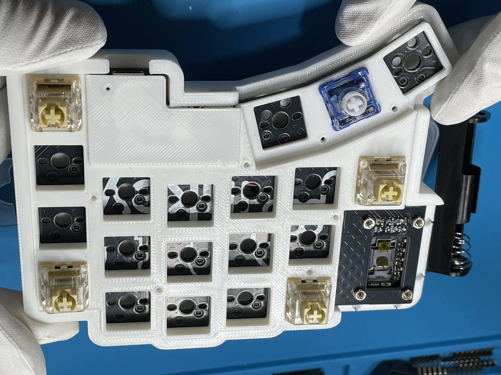
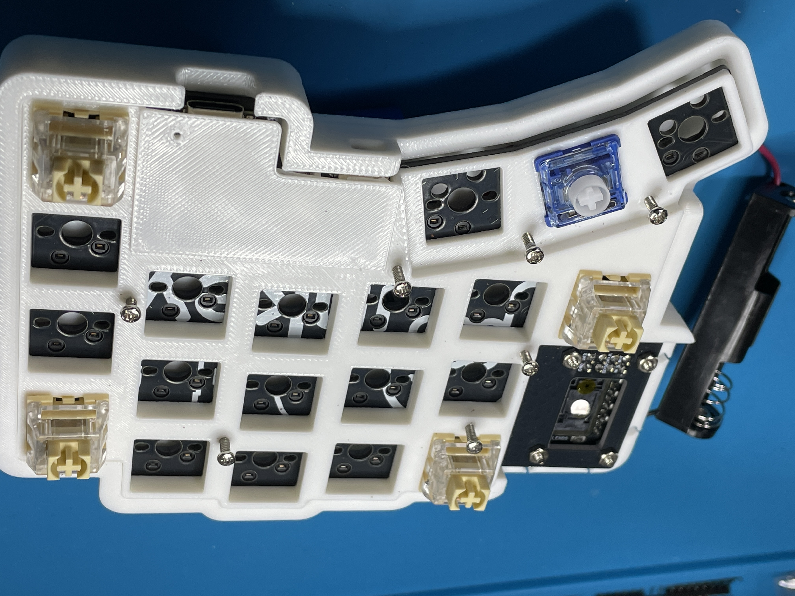
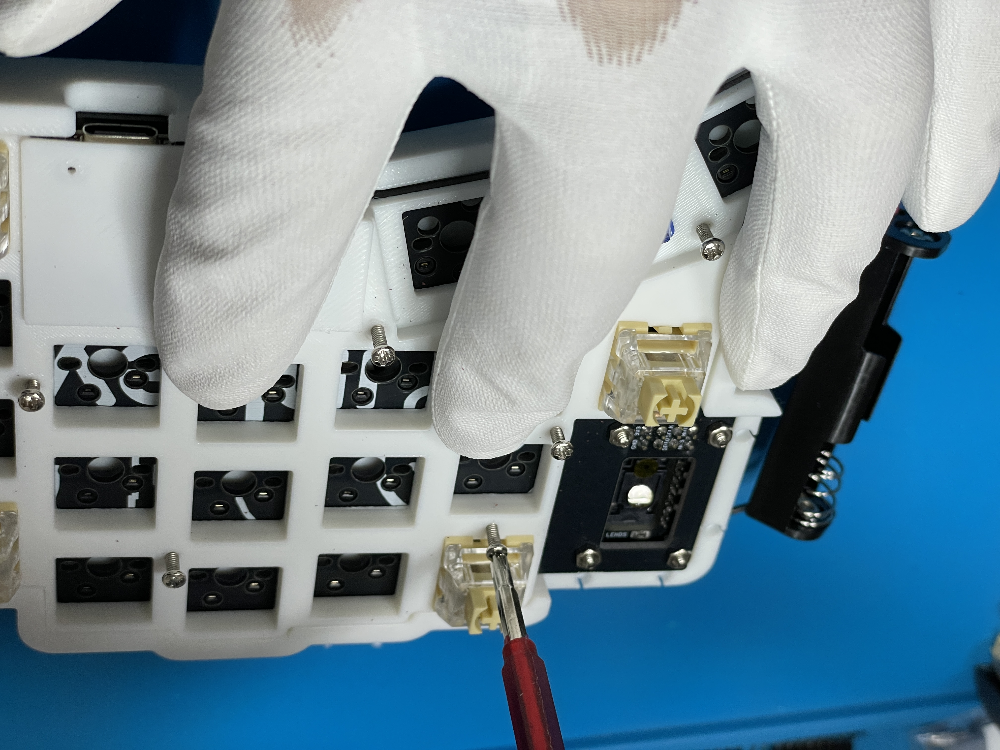

Pinkeybdの通常版をご購入いただいた方向けのビルドガイドです。

# 0. 改定履歴
| 日付 | 内容 | 
| :----: | :---- |
| 2025/12/01 | 初版 |

# 1. 目次
- [0. 改定履歴](#0-改定履歴)
- [1. 目次](#1-目次)
- [2. 準備](#2-準備)
  - [2.1 内容物](#21-内容物)
  - [2.2 別途ご準備いただくもの](#22-別途ご準備いただくもの)
  - [2.3 その他あるとよいもの](#23-その他あるとよいもの)
- [3. 実装](#3-実装)
  - [3.1 ダイオードのはんだ付け](#31-ダイオードのはんだ付け)
  - [3.2 キーソケットのはんだ付け](#32-キーソケットのはんだ付け)
  - [3.3 Xiaoの取り付け](#33-xiaoの取り付け)
  - [3.4 \[3.3V出力昇圧DCDCコンバーター\]の取り付け](#34-33v出力昇圧dcdcコンバーターの取り付け)
  - [3.5 電源スイッチの取り付け](#35-電源スイッチの取り付け)
  - [3.6 セラミックコンデンサの取り付け](#36-セラミックコンデンサの取り付け)
  - [3.7 抵抗の取り付け](#37-抵抗の取り付け)
  - [3.8 PHコネクタの取り付け](#38-phコネクタの取り付け)
  - [3.9 左手基板のロータリーエンコーダ](#39-左手基板のロータリーエンコーダ)
  - [3.10 トラックボール読み取りセンサの取り付け](#310-トラックボール読み取りセンサの取り付け)
  - [3.11 トラックボール読み取り基板の取り付け](#311-トラックボール読み取り基板の取り付け)
- [4. 仮動作確認](#4-仮動作確認)
  - [4.1 ファームウェアダウンロード](#41-ファームウェアダウンロード)
  - [4.2 ファームウェアの書き込み](#42-ファームウェアの書き込み)
  - [4.3 キーの動作確認](#43-キーの動作確認)
- [5. 組み立て](#5-組み立て)
  - [5.1 ボトムケースにマグネットを装着](#51-ボトムケースにマグネットを装着)
  - [5.2 電池ケースの配線](#52-電池ケースの配線)
  - [5.3 ボトムケースの準備](#53-ボトムケースの準備)
  - [5.4 基板とケースの組み立て](#54-基板とケースの組み立て)
  - [5.5 電池カバーケース](#55-電池カバーケース)
  - [5.6 電源スイッチカバー](#56-電源スイッチカバー)
  - [5.7 トラックボールケース](#57-トラックボールケース)
- [6. キースイッチとキーキャップ](#6-キースイッチとキーキャップ)
- [7. ファームウェアの書き換えとキーマップ変更](#7-ファームウェアの書き換えとキーマップ変更)
- [8. トラブルシューティング](#8-トラブルシューティング)
- [9. Discordサーバ](#9-discordサーバ)

# 2. 準備
キットの内容物と別途準備いただくものを確認してください。

## 2.1 内容物
[パーツリスト](/partslist.md)を参照ください。

## 2.2 別途ご準備いただくもの
| 部品名 | 数量 | 主な購入先|
| ---- | ----: | ---- |
|Seeed Xiao BLE nRF52840 | 2 | https://akizukidenshi.com/catalog/g/g117341/ |
|PMW3610 ブレイクアウトボード SEIBOKU（青墨） | 1 | https://booth.pm/ja/items/6363907?srsltid=AfmBOooXQEWyThINmj-5S1s9w4ln55OPvNEPTU_EjSfsdfYdSUeQe4cA |
|PMW3610DM-SUDU | 1| https://shop.talpkeyboard.com/products/pmw3610dm-sudu-lm18-lsi?srsltid=AfmBOoqtJ3LhU635Wn0_PQGOc6NRJciYGVhtWGX2TfN7gqWDSKNT-lsX |
|PMW3610DM Sensor lens | 1 | 同上 |
|THQWGD001 組み立て部品セット | 1 | - |
|ベアリング 内径 1.5mm 外径 4mm 幅 2mm  | 3 | https://amzn.to/4rdIJV1 |
|はんだごて | 1 | - |
|はんだ | 1 | - |
|ニッパー | 1 | - |
|圧着ペンチ | 1 | - |
|プラスドライバー | 1 | - |
|USB Type-C ケーブル | 1 | - |

## 2.3 その他あるとよいもの
| 部品名 | 数量 |
| ---- | ----: |
|ピンセット| 1|
|フラックス| 1|
|マスキングテープ| 1|
|細ペンチ | 1|

# 3. 実装
## 3.1 ダイオードのはんだ付け
ダイオードの向きに注意して、はんだ付けをします。
先に基盤の片側どちらかに予備はんだをしておき、予備はんだを溶かしながらつけていくとよいです。
ダイオードの数が多いですが、向きを間違えないように気を付けて行います。

## 3.2 キーソケットのはんだ付け
Cherry MX互換キースイッチ向けのキーソケットをはんだ付けします。
こちらは、ソケットの設置箇所に予備はんだをしておき、はんだを溶かしながら押し込むとよいです。

親指部分のKailh Choc V1向けのキーソケットも同様にはんだ付けします。

## 3.3 Xiaoの取り付け
基板の表面（ロゴが印字されている面）にSeeed Xiao BLE nRF52840を直接配置しピンヘッダーを差し込んでと固定します。
フラックスがある場合は、Xiaoのピン側面と基板のパッド部分に塗り隅の位置をはんだ付けします。

端のだけをはんだ付けしピンヘッダーを抜き、その他のピン部分をはんだ付けします。

裏面の電源ピンのはんだ付けをします。フラックスがある場合は、フラックスをしっかり塗ってからはんだ付けします。すこし基板を傾けながら行うとやりやすいです。

## 3.4 [3.3V出力昇圧DCDCコンバーター]の取り付け
ピンヘッダーを使用して3.3V出力昇圧DCDCコンバーターを基板の表面（ロゴが印字されている面）に取り付けます。

**必ず、基板に印字されているシルクと3.3V出力昇圧DCDCコンバーターのピンが一致していることを確認します。素子が付いている面をPinkeybdのメイン基板にしてください。** マスキングテープで3.3V出力昇圧DCDCコンバーターを固定し、基板の裏面をはんだ付けします。その後、テープを片面ずつ外しながら、3.3V出力昇圧DCDCコンバーターもはんだ付けします。

:::note alert 注意
左手基板の右下の「I」のピンははんだ付けしないようにしてください。
※画像では付けしておりますがEN側については、「G」と「EN」ピンのみとしてピンヘッダーを抜いて取り付けを行ってください。
※右手側はすべてのピンをはんだ付けして問題ありません。
:::

## 3.5 電源スイッチの取り付け
スライドスイッチを基板の表面（ロゴが印字されている面）から差し込みマスキングテープで固定して基板に取り付けます。

導通していない端の二つ足も固定のためにはんだ付けします。

## 3.6 セラミックコンデンサの取り付け
C2の位置に1μFのセラミックコンデンサを取り付けます。

 

C1の位置に47μFのセラミックコンデンサを取り付けます。

## 3.7 抵抗の取り付け
R1の位置にカーボン抵抗を取り付けます。

裏面から差し込み、表面ではんだ付けします。

## 3.8 PHコネクタの取り付け
PHコネクター ベース付ポストを基板にシルクの向きに合わせて裏面からはんだ付けします。

:::note 情報
3.1～3.6は、右手基板と左手基板で共通して行います。
:::

## 3.9 左手基板のロータリーエンコーダ
Wheel Encoderを基板に取り付けます。

先に、ホイールクリックのためのタクトスイッチをはんだ付けします。

このとき片側の足だけを本体基板に挿し込みますができるだけ内側（基板中心）に寄せます。タクトスイッチがケースと干渉するのは防ぐためです。タクトスイッチのはんだ付けができたら、片側の足２本をニッパで切断します。

THQWGD001の部品を組み立てて、ナットのM2ねじで左手基板と固定します。

## 3.10 トラックボール読み取りセンサの取り付け
PMW3610 ブレイクアウトボード SEIBOKU（青墨）に、PMW3610DM-SUDUをはんだ付けします。

向きを間違えないようにします。はんだづけが完了したら、保護シールを外します。
※キーボードケース取り付け後でも問題ありません。

## 3.11 トラックボール読み取り基板の取り付け
PMW3610 ブレイクアウトボード SEIBOKU（青墨）を右手基板に取り付けます。
PMW3610 ブレイクアウトボード SEIBOKU（青墨）の四隅の穴にM2 8mmネジを通します。

その上からナットを通して仮止めしてします。

Pinkeybdの右手基板に裏面から差し込み、ナットで仮止めします。

片側が長い４ピンのピンヘッダーを２つ使い右手基板の表面から挿してSEIBOKUのピン穴にも通します。

PMW3610 ブレイクアウトボード SEIBOKU（青墨）裏面のピンをはんだづけします。

表面にしてピンヘッダーのハウジング（外装）部分を取り外して、基板側もはんだ付けします。

# 4. 仮動作確認
## 4.1 ファームウェアダウンロード
この時点で仮で動作確認を行います。
下記リンクからビルド済みのファームウェアをダウンロードしてください。

## 4.2 ファームウェアの書き込み
左手用基板のXiaoのUSB Type-C（データ転送対応用）とコンピュータを接続し、リセットボタンをダブルクリックします。
ダウンロードした.uf2ファイル（左手用）をコピーします。
右手用ファイルには右手のXiaoにコピーします。

## 4.3 キーの動作確認
左右それぞれのXiaoにUSB Type-Cで接続し各キーが反応することを確認します。
反応しないキーが存在していた場合、はんだ付けになんらかの問題があるか可能性があります。

# 5. 組み立て
## 5.1 ボトムケースにマグネットを装着
ボトムケースの裏面にマグネットを挿入する穴が6つあります。
そこにマグネットを装着します。
穴はマグネットがぴったり（すぎる程）収まるサイズで、挿入時にはすこし強く押し込む必要があります。また、一度挿入すると簡単に抜けません。
N極、S極をどちらのするのか決めて装着してください。
向きを間違えないようにするために、あらかじめ片側に印をつけてから行います。
左右のケースを背中合わせでくっつけたい場合（この場合は電池ケースは左右で共有できない）と、電池ケースカバーを左右どちらも装着できるようにする場合（この場合は左右のケースを背中合わせでくっつけることができない）を選択し、装着します。
この作業は、組み立て作業の最後に行っても問題ありません。

## 5.2 電池ケースの配線
電池ケースとPHコネクタハウジングを作成します。
まず、電池ケースのリード線をケースの裏側から通します。

リード線の先端にPHコネクターコンタクトをはんだ付けします。

圧着ペンチを使ってリード線とPHコネクターコンタクトを圧着します。

PHコネクター ハウジングに装着します。

必ず、差し込む向きに線がある方を上側にしたとき、右側を赤いリード線（電池のプラス側）となるように差し込みます。

左手用も右手用も両方同じように配線します。

## 5.3 ボトムケースの準備
ボトムケースに映えているネジを差し込む用の穴に、M2ネジを使ってねじ溝を作成します。数ミリ程度、ねじを挿入して反対に回して抜きます。

右手用ケースと左手用ケースをそれぞれ7箇所ずつ行います。

## 5.4 基板とケースの組み立て
PHコネクターハウジングを基板裏から四角い穴から通しておきます。

基板をボトムケースにはめ込みます。

このとき、電源スイッチがボトムケースに引っかかることがあるので
下側（電源スイッチ側）から先に差し込むようにして基板をはめ込みます。
PHコネクターハウジングを基板のPHコネクターに挿入します。

トッププレートを上からかぶせます。

キースイッチを四隅にはめ込み位置を固定します。

M2 8mmのねじで5箇所（両手10箇所）、M2 6mmのネジで親指部分の2箇所（両手2箇所）を仮ネジ止めします。

ボトムケースとトッププレートの位置がずれないように位置を調整しながら、ネジを挿入します。トップレートが浮いてしまう場合は少し抑えながらネジを挿入します。

## 5.5 電池カバーケース
マグネットを6箇所装着します。印をつけた向きを確認し、接着剤等で装着します。※こちらは、穴のサイズは緩めです。
電池ケースを本体に近づけるようにしてリード線を中にしまい込み、電池カバーケースをマグネットで固定させます。

## 5.6 電源スイッチカバー
電源スチッチカバーを取り付けます。
電源は、内側（人差し指側）にスライドするとONになります。

## 5.7 トラックボールケース
付属のシャフト5mmにベアリングを通します。（ベアリングは別途ご準備ください。）
トラックボールケースの3箇所ベアリング装着用の溝がありますので、はめ込みます。
トラックボールケース側のマグネットを4箇所はめます。

同様に、右手ボトムケースのトラックボールケース設置箇所の縁の4箇所にマグネットを装着します。

PMW3610のレンズ保護がはずれており
PMW3610のレンズがはまっていることを確認してトラックボールケースを設置します。

# 6. キースイッチとキーキャップ
お好きなキースイッチとキーキャップをはめてください。

# 7. ファームウェアの書き換えとキーマップ変更
ファームウェアのファイルと、デフォルトキーマップを公開します。
.keymapファイルを変更し、ビルドして書き込み直して下さい。

ビルドの方法については、
購入者様へのDiscordチャンネルへ招待しますので
そちらでご相談ください。

# 8. トラブルシューティング
電池から異臭がする、または昇圧回路が熱くなっている場合はショートしている可能性があるため、テスターを使って導通チェックを行ってください。

# 9. Discordサーバ
Pinkeybdをご購入の方にDisocordの招待リンクを送らせていただきます。
そちらで困ったことがありましたら、ご相談いただければできる限り対応させていただきます。
